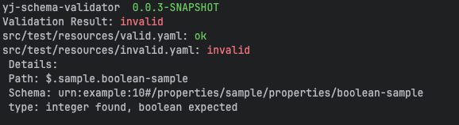

:version: 1.0.1
= YJ Schema Validator

image:https://img.shields.io/maven-central/v/org.alexmond/yj-schema-validator.svg?label=Maven%20Central[Maven Central,link=https://search.maven.org/artifact/yj-schema-validator]
image:https://img.shields.io/badge/License-Apache%202.0-blue.svg[License,link=LICENSE]
image:https://img.shields.io/github/actions/workflow/status/alexmond/yj-schema-validator/maven.yml[Build Status,link=https://github.com/alexmond/yj-schema-validator/actions]
image:https://img.shields.io/badge/Java-17%2B-blue.svg[Java 17+,link=https://openjdk.org/]
image:https://codecov.io/github/alexmond/yj-schema-validator/graph/badge.svg?token=R22SVVXZT6[Code Coverage,link=https://codecov.io/github/alexmond/yj-schema-validator]

[[description]]
== Description

YJ Schema Validator is a lightweight Java CLI tool for validating YAML and JSON files against JSON Schema definitions (drafts 2019-09/2020-12). Built with Spring Boot for easy bootstrapping, it uses Jackson for parsing and NetworkNT for robust validation. Perfect for quick local checks or automated CI/CD pipelines.

== Features

- *Dual Format Support*: Validates YAML *and* JSON files seamlessly.
- *Remote Schemas*: Fetch schemas via HTTP/HTTPS (with timeout & SSL ignore options).
- *Flexible Outputs*: Console (colored), JSON, YAML, JUnit (alpha) for CI integration.
- *Multi-Document YAML*: Supports `---` separated YAML documents
- *Batch Processing*: Validate multiple files in one run; exits 0 on success, 1 on failure.
- *Schema Override*: Ignore embedded `$schema` in files for centralized control.
- Java 17+ compatible; no external deps beyond the fat JAR.

== Installation

Download the latest fat JAR from Maven Central:

[source,bash,subs=+attributes]
----
curl -L -o yj-schema-validator.jar https://repo1.maven.org/maven2/org/alexmond/yj-schema-validator/{version}/yj-schema-validator-{version}.jar
----

Verify: `java -jar yj-schema-validator.jar --help`

Build from source (requires Maven and Java 17+):

[source,bash,subs=+attributes]
----
git clone https://github.com/alexmond/yj-schema-validator.git
cd yj-schema-validator
mvn clean package
java -jar target/yj-schema-validator-{version}.jar --help
----

== Usage

Basic syntax: `java -jar yj-schema-validator.jar [options] <file1> <file2> ...`

=== Quick Start

Validate a single file (assumes schema in file's `$schema`):

[source,bash]
----
java -jar yj-schema-validator.jar config.yaml
# Output: config.yaml: ok
#         Validation Result: ok
----

With explicit schema:

[source,bash]
----
java -jar yj-schema-validator.jar config.yaml --schema=schema.json
----

Batch with JUnit report (for CI):

[source,bash]
----
java -jar yj-schema-validator.jar *.yaml --schema=schema.json --report-type=junit --report-file-name=report.xml
----

Multi-document support
[source,bash]
----
java -jar yj-schema-validator.jar src/test/resources/multi3valid.yaml
Validation Result: ok
src/test/resources/multi3valid.yaml-1: ok
src/test/resources/multi3valid.yaml-3: ok
src/test/resources/multi3valid.yaml-2: ok
----
=== CI/CD Integration Example (GitHub Actions)

[source,yaml,subs=+attributes]
----
- name: Validate Schemas
  run: |
    curl -L -o yj-schema-validator.jar https://repo1.maven.org/maven2/org/alexmond/yj-schema-validator/{version}/yj-schema-validator-{version}.jar
    java -jar yj-schema-validator.jar config/*.yaml --schema=schema.json --report-type=junit > report.xml
  # Use actions like 'dorny/test-reporter' to publish report.xml
----

== Configuration

|===
|Flag |Description |Default |Example
|`--help`
|Show usage help
|N/A
|`--help`

|`--files`
|Path to input YAML/JSON file(s) (positional args also supported)
|N/A
|`--files=app.yaml or "app.yaml,config.json"

|`--schema`
|Path or URL to JSON Schema file
|Embedded `$schema` in file
|`--schema=schema.json` or `--schema=https://example.com/schema.json`

|`--report-type`
|Output format: `text` (colored console), `json`, `yaml`, `junit` (alpha)
|`text`
|`--report-type=junit`

|`--report-file-name`
|Output file for non-console reports
|stdout
|`--report-file-name=validation.json`

|`--color`
|Enable/disable colored output
|`true`
|`--color=false`

|`--http-timeout`
|Timeout (seconds) for remote schema fetches
|10
|`--http-timeout=30`

|`--ignore-ssl-errors`
|Skip SSL certificate validation for HTTPS schemas
|`false`
|`--ignore-ssl-errors`

|===

== Troubleshooting

|===
|Issue |Cause |Solution

|"No schema found"
|Missing `--schema`
|Provide via flag or embed in file.

|YAML parse error
|Invalid syntax
|Check line/col in error; use `--color=false` for plain text.

|HTTP timeout
|Slow remote schema
|Increase `--http-timeout=30`.

|JUnit alpha issues
|Experimental
|Report bugs; fallback to JSON.
|===

For SSL issues: Use `--ignore-ssl-errors` (not recommended for production).

== Contributing

1. Fork the repo and create a feature branch (`git checkout -b feat/amazing-feature`).
2. Commit changes (`git commit -m 'Add some AmazingFeature'`).
3. Push to the branch (`git push origin feat/amazing-feature`).
4. Open a Pull Request.

Build and test locally:

[source,bash]
----
mvn clean package
mvn test
----

See link:https://github.com/alexmond/yj-schema-validator/issues[open issues] for details.

[[license]]
== License

Licensed under link:LICENSE[Apache 2.0 License].

== Acknowledgments

- Built on link:https://github.com/networknt/json-schema-validator[NetworkNT JSON Schema Validator].
- Thanks to contributors: link:https://github.com/alexmond/yj-schema-validator/graphs/contributors[List here].

== Full Documentation

link:https://alexmond.github.io/yj-schema-validator/current/index.html[Read the full docs here]